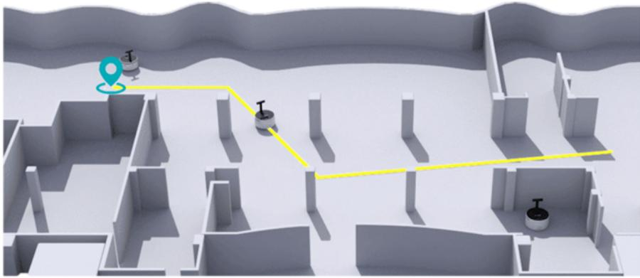
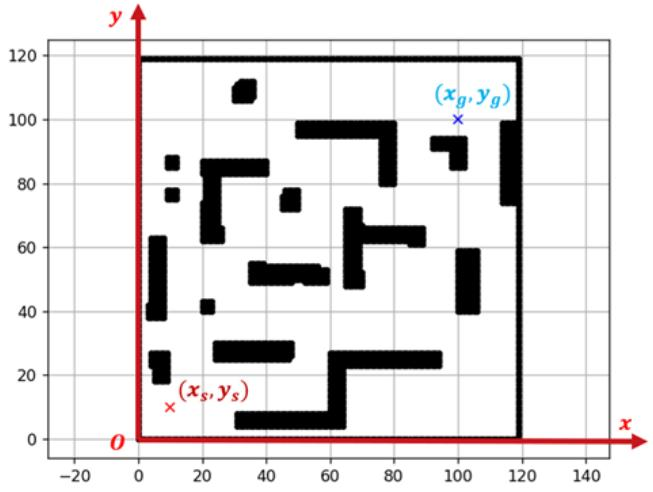
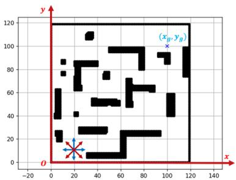
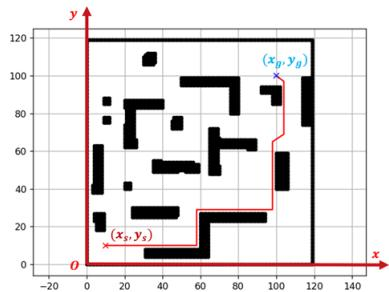
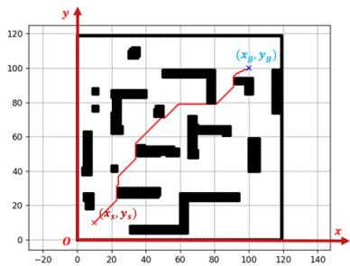
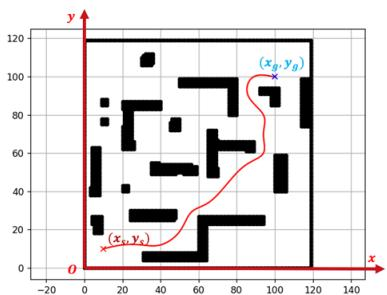
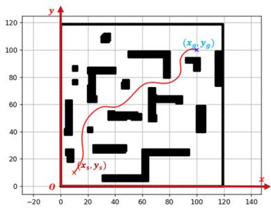
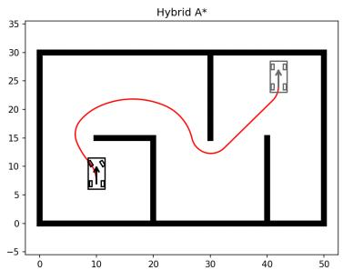

# AI 3603 Artificial Intelligence: Principles and Techniques

Homework 1: Search Algorithm Due Oct. 20th 11:59 p.m.

Adhere to the Code of Academic Integrity. You may discuss background issues and general strategies with others and seek help from course staff, but the implementations that you submit must be your own. In particular, you may discuss general ideas with others but you may not work out the detailed solutions with others. It is never OK for you to see or hear another student's code and it is never OK to copy code from published/Internet sources. Moss (Measure Of Software Similarity) will be used for determining the similarity of programs to detect plagiarism in the class (https://theory.stanford.edu/~aiken/moss/). If you encounter some difficulties or feel that you cannot complete the assignment on your own, discuss it with your classmates in the Discussion forum on Canvas, or seek help from the course staff. You can complete this homework individually.

When submitting your assignment, follow the instructions summarized in Section 7 of this document.

## 1. Introduction

### 1.1 Description

In this homework, you will develop a path-planning framework for a service robot in a room using A\* algorithm. The task scenario is shown in Fig. 1. The 2D global map is given. You are required to design and implement the path planning algorithm according to the following task requirements.

  
Figure 1: Path planning of a service robot.

### 1.2 Provided File List

The provided files for this homework including:

-   1-HW1 Assignment.pdf: The introduction and description of homework 1.
-   2-Report_Template: A latex template for the report.
-   3-map: A 2D map in numpy array format.
-   4-Example.py: An example code of path planning for homework 1.
-   5-Task_1.py: The code for basic A\* algorithm to be completed.
-   6-Task_2.py: The code for improved A\* algorithm to be completed.
-   7-Task_3.py: The code for self-driving planning algorithm to be completed.

### 1.3 Submission File List

-   Task_1.py: The completed code for $\mathrm{A}^*$ algorithm.
-   Task_2.py: The completed code for improved A\* algorithm.
-   Task_3.py: The completed code for self-driving planning algorithm.
-   HW1_report.pdf: Report for homework 1.

## 2. Task 1: Basic A\* Algorithm [40 points]

In this task, you need to implement the basic A* algorithm. The robot's starting position, target position, and global map are all known. You can control the robot to move forward, backward, left, and right. To implement the A* algorithm, the $120\mathrm{m} \times 120\mathrm{m}$ world map is discretized into a grid map, where a grid indicates a $1.0\mathrm{m} \times 1.0\mathrm{m}$ block in the world. The coordinate system of the grid map is defined in Fig. 2. The start position of the robot is indicated as $(x_s, y_s)$ , and the goal position is indicated as $(x_g, y_g)$ .

  
Figure 2: Coordinate system of the world.

## 3. Task 2: Improved A\* Algorithm [30 points]

Although the $\mathrm{A}^*$ algorithm can theoretically plan an optimal (or shortest) path, you may find that the path planned by the $\mathrm{A}^*$ algorithm in Section 2 may not be good enough, such as frequent turns and close distance to the obstacles. Hence in this section, you will implement an improved $\mathrm{A}^*$ algorithm to improve the performance of the $\mathrm{A}^*$ planner. Specifically, you are asked to formulate and incorporate the following factors into the $\mathrm{A}^*$ algorithm:

-   Possibility of moving towards upper left, upper right, bottom left, bottom right, shown as Fig. 3(a);
-   Consider the distance between the robot and the obstacle to avoid possible collisions. For example, the path shown in Fig. 3(b) is too close to the obstacles;
-   Adding the cost of steering to reduce unnecessary turns in the path as shown in Fig. 3(c).


(a)


(b)


Figure 3: Some factors to consider for improving $\mathbf{A}^*$ algorithm.  
(c)

## 4. Task 3: Path Planning for Self-driving [30 points]

Due to the discretization of the map, the paths obtained by the methods in Section 2 and 3 are not smooth. However, smoothness is usually required to guarantee the comfort and energy efficiency of self-driving cars. In this section, you are asked to improve the smoothness of the path.

The following are three possible methods for solving this task. The first two trajectory smoothing methods are relatively simple and are easy to implement and complete this task. The latter method is more practical in real applications, which requires you to build a car model, and thus is relatively more complex.

-   Polynomial interpolation[1];
-   Bezier curve[2];
-   Hybrid $\mathrm{A}^*$ algorithm[3, 4];

Most importantly, you can choose any of the methods listed above to accomplish this task. We encourage you to review relevant papers on implementing the hybrid $\mathbf{A}^*$ algorithm or propose your own ideas. Please describe your solution in detail in your report, including but not limited to the analysis process, code design, and parameter tuning.

  
(a)

  
Figure 4: Smoothness of the path.  
(b)

  
(c)

## 5. Code and Report

Code: You can edit your code between "#### START CODE HERE ####" and "#### END CODE HERE ###". Please **DO NOT** revise other parts of the code. The code block to be completed is described below.

```py
### START CODE HERE ###
# This code block is optional. You can define your utility function and class in this block if necessary.


### END CODE HERE ###
```

```py
def A_star(world_map, start_pos, goal_pos):
    """
    Given map of the world, start position of the robot and the position of the goal, 
    plan a path from start position to the goal using A* algorithm.

    Arguments:
    world_map -- A 120*120 array indicating current map, where 0 indicating traversable and 1 indicating obstacles.
    start_pos -- A 2D vector indicating the current position of the robot.
    goal_pos -- A 2D vector indicating the position of the goal.

    Return:
    path -- A N*2 array representing the planned path by A* algorithm.
    """

    ### START CODE HERE ###
   

   
    ###  END CODE HERE  ###
    return path
```

```py
def Improved_A_star(world_map, start_pos, goal_pos):
    """
    Given map of the world, start position of the robot and the position of the goal, 
    plan a path from start position to the goal using A* algorithm.

    Arguments:
    world_map -- A 120*120 array indicating current map, where 0 indicating traversable and 1 indicating obstacles.
    start_pos -- A 2D vector indicating the current position of the robot.
    goal_pos -- A 2D vector indicating the position of the goal.

    Return:
    path -- A N*2 array representing the planned path by A* algorithm.
    """

    ### START CODE HERE ###
  


    ###  END CODE HERE  ###
    return path
```

```py
def Self_driving_path_planner(world_map, start_pos, goal_pos):
    """
    Given map of the world, start position of the robot and the position of the goal, 
    plan a path from start position to the goal using A* algorithm.

    Arguments:
    world_map -- A 120*120 array indicating current map, where 0 indicating traversable and 1 indicating obstacles.
    start_pos -- A 2D vector indicating the current position of the robot.
    goal_pos -- A 2D vector indicating the position of the goal.

    Return:
    path -- A N*2 array representing the planned path by A* algorithm.
    """

    ### START CODE HERE ###


    ###  END CODE HERE  ###
    return path
```

**Report:** Writing in English. Summarize the process and results of the homework, including but not limited to:

-   The description, formulation, and implementation of $\mathrm{A}^*$ and improved $\mathrm{A}^*$ .
-   The comparison between $\mathrm{A}^*$ and improved $\mathrm{A}^*$ algorithm, such as computational time, safety, optimality, etc.
-   The description, formulation and implementation of your algorithm to improve the smoothness of the path.
-   The figures of paths planned in each task are required to be given in the report.

## 6. Discussion and Question

You are encouraged to discuss your ideas, and ask and answer questions about homework 1. A new post for this assignment "Homework 1 Discussion" is opened in the Discussion Forum on Canvas. If you encounter any difficulty with the assignment, try to post your problem for help. The classmates and the course staff will try to reply.

## 7. Submission Instructions

1. Zip your python code files Task_1.py, Task_2.py, Task_3.py and the report file HW1_report.pdf to a zip file named as HW1_Name_ID.zip for individually.
2. Upload the file to "Homework 1: Search Algorithm" on Canvas. Due: Oct. 20th 11:59 p.m.

## References

1. "Basics of polynomial interpolation," https://www.baelung.com/cs/polynomial-interpolation.  
2. “Bzier curve,” https://en.wikipedia.org/wiki/B%C3%A9zier_curve.  
3. M. Montemerlo and J. Diebel, "Path planning for autonomous vehicles in unknown semi-structured environments," Ann Arbor, vol. 1001, p. 48105.  
4. K. Kurzer, "Path planning in unstructured environments: A real-time hybrid a\* implementation for fast and deterministic path generation for the kth research concept vehicle," 2016.
